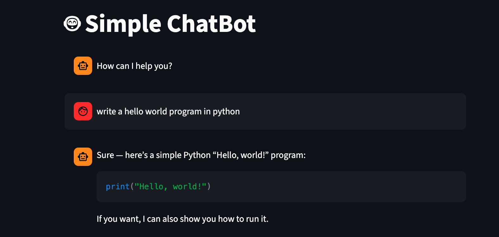

# 🤖 Simple ChatBot

A simple chatbot web app built with **Streamlit** and **OpenAI GPT API**.

---

## 📁 Project Structure

```
├── gpt_chatbot.py   # Core chatbot logic (OpenAI API integration)
└── app.py           # Streamlit web interface
```

---

## ⚙️ Requirements

- Python 3.8+
- An [OpenAI API key](https://platform.openai.com/account/api-keys)

Install dependencies:

```bash
pip install -r requirements.txt
```

---

## 🚀 Running the App

```bash
streamlit run src/app.py
```

Then open your browser at `http://localhost:8501`.

---

## 🔑 API Key Setup

Enter your OpenAI API key in the **sidebar** of the app. The key is never stored and is only used during the session.

> ⚠️ **Warning:** Never hardcode your API key in source files or commit it to version control.

---

## 💬 How It Works

1. The user enters a message in the chat input.
2. The message is sent to `chatbot()` in `gpt_chatbot.py`.
3. The function calls the OpenAI Responses API using the `gpt-5.4-mini` model.
4. The response is displayed in the chat UI and stored in session state.

### Error Handling

| Error | Behavior |
|---|---|
| Rate limit exceeded | Prints a warning message |
| Invalid / unauthorized key (401, 403) | Prints the error body |
| Other failures | Returns a fallback message to the user |

---

## 📌 Notes

- Chat history is maintained per session using `st.session_state`.
- The app does **not** pass conversation history to the API — each message is sent independently.


You can visit streamlit streamlit [documentation](https://docs.streamlit.io) and [community
forums](https://discuss.streamlit.io).

---


